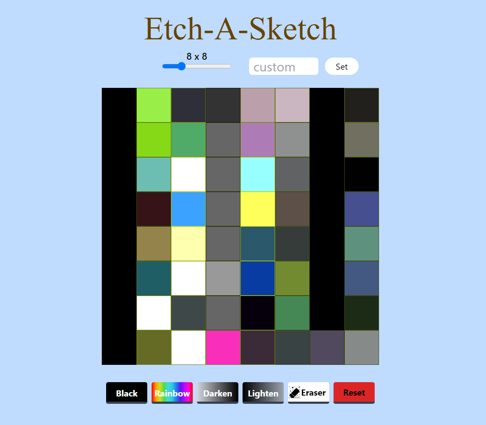

# Etch-a-sketch

Application with similar functions as a physical **sketch pad**.

[Live Demo](https://complexlity-etch-a-sketch.netlify.app/) :point_left:



## Features

- Change box sizes
- **Black** ink drawing
- **Rainbow** ink drawing
- **Lighten** any color on the sketch pad
- **Darken** any color on the sketch pad
- **Eraser** to revert any color
- **Reset** to reset all box colors

## Technologies used

- JavaScript
- TailwindCSS

## Geting started

### Clone repository

```
git clone https://github.com/Complexlity/etch-a-sketch.git
cd etch-a-sketch
```

### Install dependencies

```
npm install
```

### Start Application

```
npm  run build
```

Open the folder in a browser
